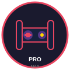

<p align="center">
  
</p>

<h1 align="center">🎮 Game Dev Pro Max</h1>

<p align="center">
  <strong>从0到1，让AI帮你做一款游戏</strong>
</p>

<p align="center">
  <a href="#-快速上手">快速上手</a> •
  <a href="#-项目结构">项目结构</a> •
  <a href="#-路线图">路线图</a> •
  <a href="#-%E4%BD%BF%E7%94%A8%E6%96%B9%E5%BC%8F">使用方式</a> •
  <a href="#-contributing">贡献指南</a>
</p>

<p align="center">
  
  
  
  
</p>

---

## 🤔 这是什么？

**Game Dev Pro Max** 是一份面向 AI Agent（Hermes Agent、Claude Code、Cursor 等）的**游戏开发指令集**。它让没有任何游戏开发经验的人，通过和 AI 对话就能从0到1制作一款完整的游戏。

### 它不是什么

❌ 不是一个游戏引擎（不需要安装任何东西）  
❌ 不是一份教程文档（没人会从头读到尾）  
✅ 是一份 **AI 的"技能"**——你只需要说"我想做个小游戏"，AI 就会按照这里面的 7 个阶段引导你完成

### 核心理念

> 🎯 **先做一个能玩的版本，再谈好不好玩。完成比完美重要。**

---

## 🚀 快速上手

### 方式一：用 Hermes Agent（推荐）

```bash
# 1. 安装本 skill
cp -r skill/ ~/.hermes/skills/game-dev-pro-max/

# 2. 对你的 AI 说：
"我想做一款游戏，加载 game-dev-pro-max，引导我开发"
```

### 方式二：用 Claude Code（或其他 AI）

```bash
# 1. 在项目根目录放上 SKILL.md
cp SKILL.md ./game-project/

# 2. 对 Claude Code 说：
"Read SKILL.md and guide me through building a game from scratch"

# 或者直接用 Claude Code 的提示：
"@SKILL.md 我想开发一个简单的 2D 平台跳跃游戏，请逐步引导我"
```

### 方式三：用 Cursor / Windsurf / Copilot

把 `SKILL.md` 放在项目根目录作为 `.cursorrules` 或直接引用即可。

---

## 📦 项目结构

```
game-dev-pro-max/
├── README.md                  # 你正在看这个 👀
├── SKILL.md                   # 🌟 核心：AI agent 技能文件（~18KB）
├── templates/
│   ├── game-design-one-pager.md   # 游戏设计一页纸模板
│   ├── html-canvas-starter.html   # HTML Canvas 空项目
│   ├── phaser-starter.html        # Phaser 3 空项目
│   └── godot-starter/             # Godot 4 空项目结构
├── examples/
│   ├── pong/                      # 完整 Pong 示例
│   ├── snake/                     # 完整贪吃蛇示例
│   └── flappy-bird/               # 完整 Flappy Bird 示例（TODO）
└── assets/
    └── logo.svg                   # 项目 logo
```

---

## 🗺️ 路线图

### Phase 0: 选游戏
帮你选一个真正能做完的游戏，而不是"梦想中的3A大作"

### Phase 1: 搭环境
HTML Canvas / Phaser 3 / Godot — 3条路任选，各有完整启动模板

### Phase 2: 做核心玩法
移动 → 交互 → 挑战 → 胜负 → 重开。5步走完，游戏就能玩了

### Phase 3: 丰富内容
关卡、分数、AI敌人、道具系统

### Phase 4: 打磨
音效、画面、抖动、粒子特效

### Phase 5: 测试
找人玩，看他哪里卡住，修掉

### Phase 6: 发布
itch.io / GitHub Pages / 移动端

---

## 📋 使用方式

### 给 AI Agent 使用

Hermes Agent 用户直接加载 skill：

```
skill_view(name='game-dev-pro-max')
```

然后 AI 会自动引导你通过 7 个阶段完成游戏开发。

### 给人阅读

直接打开 [SKILL.md](SKILL.md) 看。全中文写作，包含：

- 每个阶段该做什么、不该做什么
- 可直接运行的 HTML 代码模板
- 免费的资源网站汇总（音效、素材、字体）
- 10 个新手最常见的坑
- 验证清单

---

## 📝 示例：一个可玩的 Pong

[examples/pong/](examples/pong/) 目录下有一个完整的 Pong 游戏示例，大约 100 行 JavaScript：

```html
<!DOCTYPE html>
<html>
<head><title>Pong</title></head>
<body>
<canvas id="game" width="800" height="400"></canvas>
<script>
  // 打开 examples/pong/index.html 就能玩！
</script>
</body>
</html>
```

打开浏览器就能玩。不需要安装任何东西。

---

## 🤝 Contributing

这个项目欢迎所有贡献！你可以：

- 🐛 **提 Issue** — 发现 AI 引导有 bug 或逻辑漏洞
- 💡 **提 Feature** — 想增加新的游戏类型示例
- 📝 **提交 PR** — 完善文档、修复错别字、增加游戏示例
- 🌍 **翻译** — 帮忙翻译成其他语言

### 如何贡献

```bash
git clone https://github.com/<你的用户名>/game-dev-pro-max.git
cd game-dev-pro-max
# 修改文件后
git commit -m "add: 新的游戏示例"
git push
# 创建 Pull Request
```

### Roadmap

- [ ] 更完整的示例游戏（打砖块、俄罗斯方块、2048）
- [ ] Godot 4 完整入门指南
- [ ] 移动端打包（Cordova / Capacitor）详细教程
- [ ] 多人游戏入门（Phaser + Colyseus）
- [ ] 发布到 npm / CLI 工具

---

## 📄 License

MIT © 2025 夏娃 Hermes Agent

---

<p align="center">
  <sub>Made with ❤️ by 夏娃 for everyone who wants to make a game</sub>
</p>
